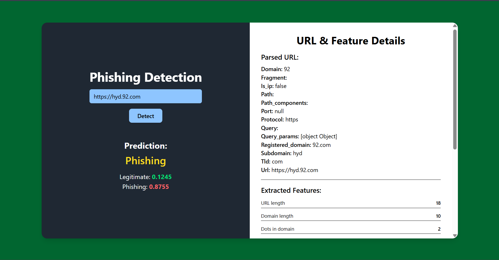
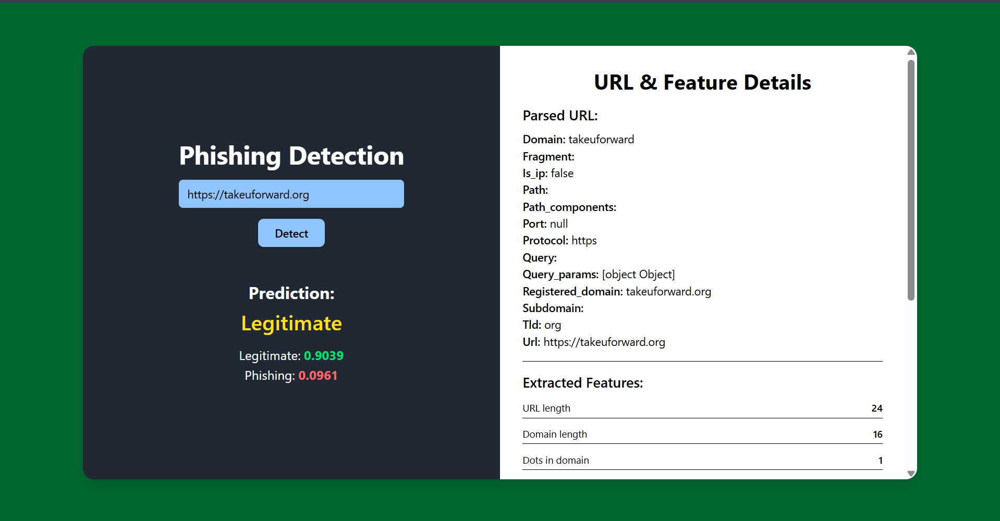

# PhishUrlHunter-ReinforcementLearning

**PhishUrlHunter** is a phishing detection project that identifies malicious URLs and websites using Deep Reinforcement Learning, specifically a Deep Q-Network (DQN). The project includes feature extraction pipelines, backend server logic, and a web-based frontend for real-time phishing detection.

---
## Implementation Demo



---

## Features

- Extracts and processes URL and website features for phishing analysis.  
- Real-time detection through a Python backend server (`server.py`).  
- User-friendly web frontend for submitting URLs and viewing results.  
- Modular design for easy updates and improvements to detection logic.  
- Logging, visualization, and evaluation of detection results.  
- Strictly for defensive research and mitigation of phishing attacks.

---

## Clone The Repository

You can get the project in two ways:

**Clone the repository**:  
```bash
git clone https://github.com/RamakotireddyGuttikonda/PhishUrlHunter.git
cd PhishingDetection-ReinforcementLearning
```


---

## Installation

1. **Create a Python virtual environment**  
```bash
cd backend
pip install -r requirements.txt
```
- You can create a virtual Environment if needed.
---

**Run the Backend**:
```bash
python server.py
```

**Run the Frontend**:  
```bash
cd PhishingDetection-ReinforcementLearning
npm install @vitejs/plugin-react --save-dev
npm run dev
```
- By default, the server runs at `http://localhost:5000/`.
---
 

**Test phishing detection**  
- Enter URLs in the web app input field and submit.  
- The server will return detection results in real-time.


**Thank you**
- If you consider my project a good one !! please star it !!
- you can contact me via ramakotireddyguttikonda8@gmail.com
